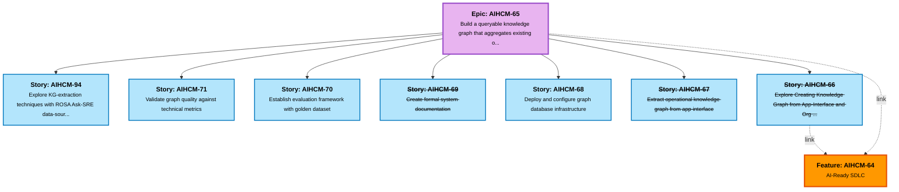

# Work Item Tree: AIHCM-65

**Type:** Epic  
**Summary:** Build a queryable knowledge graph that aggregates existing operational data sources.

```mermaid
graph TD
    AIHCM_65["<b>Epic: AIHCM-65</b><br/><small>Build a queryable knowledge graph that aggregates existing o...</small>"]:::epic
    AIHCM_94["<b>Story: AIHCM-94</b><br/><small>Explore KG-extraction techniques with ROSA Ask-SRE data-sour...</small>"]:::story
    AIHCM_65 --> AIHCM_94
    AIHCM_71["<b>Story: AIHCM-71</b><br/><small>Validate graph quality against technical metrics</small>"]:::story
    AIHCM_65 --> AIHCM_71
    AIHCM_70["<b>Story: AIHCM-70</b><br/><small>Establish evaluation framework with golden dataset</small>"]:::story
    AIHCM_65 --> AIHCM_70
    AIHCM_69["<b><s>Story: AIHCM-69</s></b><br/><small><s>Create formal system documentation</s></small>"]:::story
    AIHCM_65 --> AIHCM_69
    AIHCM_68["<b>Story: AIHCM-68</b><br/><small>Deploy and configure graph database infrastructure</small>"]:::story
    AIHCM_65 --> AIHCM_68
    AIHCM_67["<b><s>Story: AIHCM-67</s></b><br/><small><s>Extract operational knowledge graph from app-interface</s></small>"]:::story
    AIHCM_65 --> AIHCM_67
    AIHCM_66["<b><s>Story: AIHCM-66</s></b><br/><small><s>Explore Creating Knowledge Graph from App-Interface and Org ...</s></small>"]:::story
    AIHCM_65 --> AIHCM_66
    AIHCM_64["<b>Feature: AIHCM-64</b><br/><small>AI-Ready SDLC</small>"]:::feature
    AIHCM_66 -.link.-> AIHCM_64
    AIHCM_65 -.link.-> AIHCM_64

    click AIHCM_65 "https://issues.redhat.com/browse/AIHCM-65" "Open AIHCM-65 in Jira" _blank
    click AIHCM_94 "https://issues.redhat.com/browse/AIHCM-94" "Open AIHCM-94 in Jira" _blank
    click AIHCM_71 "https://issues.redhat.com/browse/AIHCM-71" "Open AIHCM-71 in Jira" _blank
    click AIHCM_70 "https://issues.redhat.com/browse/AIHCM-70" "Open AIHCM-70 in Jira" _blank
    click AIHCM_69 "https://issues.redhat.com/browse/AIHCM-69" "Open AIHCM-69 in Jira" _blank
    click AIHCM_68 "https://issues.redhat.com/browse/AIHCM-68" "Open AIHCM-68 in Jira" _blank
    click AIHCM_67 "https://issues.redhat.com/browse/AIHCM-67" "Open AIHCM-67 in Jira" _blank
    click AIHCM_66 "https://issues.redhat.com/browse/AIHCM-66" "Open AIHCM-66 in Jira" _blank
    click AIHCM_64 "https://issues.redhat.com/browse/AIHCM-64" "Open AIHCM-64 in Jira" _blank

    classDef feature fill:#ff9800,stroke:#e65100,stroke-width:3px,color:#000
    classDef epic fill:#e8b4f0,stroke:#9b4dca,stroke-width:3px,color:#000
    classDef story fill:#b3e5fc,stroke:#0277bd,stroke-width:2px,color:#000
    classDef task fill:#c8e6c9,stroke:#388e3c,stroke-width:1px,color:#000
    classDef bug fill:#ffcdd2,stroke:#c62828,stroke-width:2px,color:#000
```
